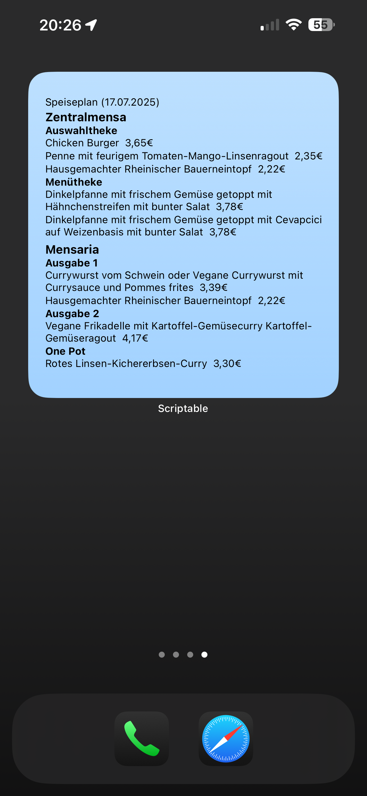
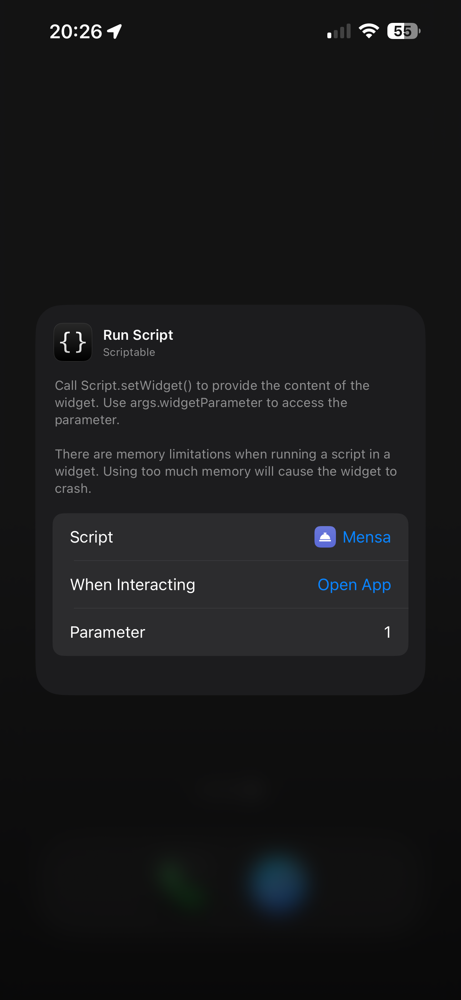

# Canteen-Widget

This project includes JavaScript code designed to generate an iOS widget that displays the daily menu of the JGU canteen. 
With this script, you can conveniently access the menu information right from your Home Screen.

## Preview

## Supported Devices

Since this script requires [Scriptable](https://scriptable.app/), your device must support it.
Therefore, you need to use iOS or iPadOS to run this script.

## Installation

1. Ensure you have [Scriptable](https://scriptable.app/) installed on your device.
2. Copy the content of the `mensa.js` file.
3. Open the Scriptable app and create a new script. You can choose a custom name and icon.
4. In the Scriptable editor, paste the copied code.
5. To add the widget to your Home Screen:
    - Open the Home Screen editor.
    - Choose the Scriptable app and select the medium or large widget.
6. After placing the widget on your Home Screen, press and hold the widget to edit it.
7. Select the script you just created.
8. If you are using a custom configuration instead of the default one, add the index of the config as a parameter. For
   example, if your config list contains the default config followed by your custom config, use `1` to select your
   custom config.

## Config Explanation

The Script already uses a default configuration. You can change the default one or create your own config and add it to
the list of configs at the top of the script.

| **Option**                  | **Description**                                                                                                                                                                                                                                                                                   | **Implementation**                             |
|-----------------------------|---------------------------------------------------------------------------------------------------------------------------------------------------------------------------------------------------------------------------------------------------------------------------------------------------|------------------------------------------------|
| **Active Canteens**         | Select up to two canteens for the large widget and one canteen for the middle widget. Possible options: Zentralmensa, Mensaria, ReWi, Bambus.                                                                                                                                                     | `activeCanteens: ["Zentralmensa"]`             |
| **Language**                | Choose between German or English.                                                                                                                                                                                                                                                                 | `language: "german"`                           |
| **Gradient Colors**         | Select exactly two colors using hex-values (without `#`). If no color is chosen, the background will be white. If only one color is chosen, the background will have that color. If more than two colors are chosen, only the first two will be used.                                             | `gradientColors: ["bde0fe", "a2d2ff"]`         |
| **URL**                     | Specify a URL that will be opened when tapping on the widget. Leave the string empty if no URL is desired.                                                                                                                                                                                        | `openURL: "https://ves.uni-mainz.de/de/mensa"` |
| **Show Prices**             | Set to `true` to display prices. It is recommended to use this option only with the large widget and one canteen activated. Otherwise, there might not be enough space to render the widget correctly.                                                                                            | `showPrices: true`                             |
| **Show Side Dishes**        | Set to `true` to display side dishes.                                                                                                                                                                                                                                                             | `showSideDishes: false`                        |
| **Always Show Salad Bar**   | Set to `true` to always display the salad bar even though there is a conflict with some allergens (useful because the salad bar includes all allergens of all possible items, even though you may choose something different).                                                                    | `alwaysShowSaladBar = false`                   |
| **Add Bullet Points**       | Set to `true` to add bullet points to the list of meals.                                                                                                                                                                                                                                          | `addBulletPoints: false`                       |
| **Use Discounted Prices**   | Set to `true` to use discounted prices.                                                                                                                                                                                                                                                           | `useDiscountedPrices: true`                    |
| **User Allergens**          | Add the short form of allergens as strings to the list. Visit the [official website](https://www.studierendenwerk-mainz.de/essentrinken/speiseplan2) and scroll to the bottom to see a list of all allergens. The example code shows the implementation if you don't want to eat gluten and beef. | `userAllergens: ["Gl", "R"]`                   | 
| **Text Color**              | Specify the color for regular text using a hex-value (without `#`).                                                                                                                                                                                                                               | `textColor: "000000"`                          |
| **Error Color**             | Specify the color for error messages (e.g., if the connection to the API fails) using a hex-value (without `#`).                                                                                                                                                                                  | `errorColor: "ff0000"`                         |
| **Header Color**            | Specify the color for the header using a hex-value (without `#`).                                                                                                                                                                                                                                 | `headerColor: "000000"`                        |
| **Switch to Tomorrow Time** | Specify the time (in hours) when the widget should switch to displaying the menu for tomorrow. If you don't want this, choose 24                                                                                                                                                                  | `switchToTomorrowTime: 18`                     |                                                                                                                                                                         |

## Disclaimer

I am not associated with the [Studierendenwerk Mainz](https://www.studierendenwerk-mainz.de/impressum). They hold the copyright for the data. 
I do not guarantee that everything will work as expected, and future changes to the API could potentially break this project. 
Due to the asynchrony, the information in the widget may not always be identical to the information provided by the Studierendenwerk.

This project is provided as-is, without any warranties of any kind, either express or implied. Use it at your own risk. 
I am not responsible for any inaccuracies, errors, or omissions in the data presented, nor for any actions taken based on this information.

The data provided is for informational purposes only and should not be relied upon for critical decisions. Always verify 
the information with the official sources or directly with the canteen staff if necessary. Your health and well-being are 
important, so please take the necessary precautions to ensure your safety.
